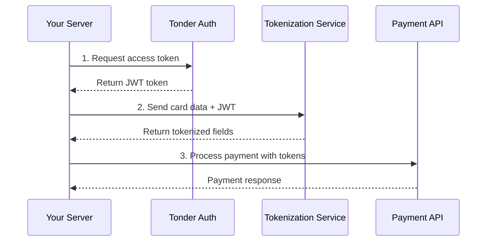
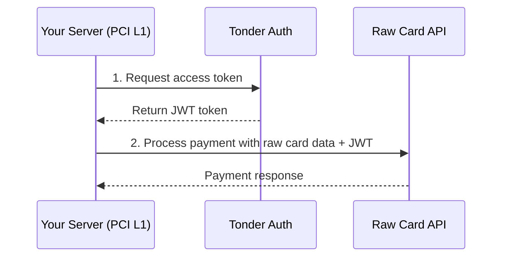

Tonder offers two paths for processing card payments through Direct Integration. The right choice depends on your PCI DSS compliance status and infrastructure.

<CardGroup cols={2}>
  <Card title="Tokenized Flow" icon="shield-check" href="/direct-integration/guides/create-payments/create-a-payment-with-a-card-token">
    **For most merchants.** Tokenize card data first, then process payments using tokens. Minimizes your PCI scope.
  </Card>
  <Card title="Raw Card Data Flow" icon="building" href="/direct-integration/guides/create-payments/raw-card-processing">
    **For PCI Level 1 certified merchants only.** Process payments with raw card numbers directly. Requires full compliance infrastructure.
  </Card>
</CardGroup>

## Comparison

| Aspect | Tokenized Flow | Raw Card Data Flow |
| --- | --- | --- |
| **PCI Requirement** | SAQ A or SAQ A-EP | Full PCI DSS Level 1 |
| **Best For** | Most merchants, startups, mid-market | Enterprise, payment processors, high-volume platforms |
| **Integration Steps** | 3 steps (get token → tokenize → process) | 2 steps (get token → process) |
| **Latency** | Slightly higher (extra tokenization call) | Lower (direct processing) |
| **Card Data Handling** | Never touches your servers | Passes through your servers |
| **Compliance Cost** | Lower | Significantly higher |

## Choose Your Path

<AccordionGroup>
  <Accordion title="Use the Tokenized Flow if..." icon="check-circle">
    - You are **not** PCI DSS Level 1 certified
    - You want to minimize compliance burden and cost
    - You're building a new payment integration
    - You need to store cards for recurring payments (tokens are reusable)
    - Your transaction volume doesn't require sub-millisecond optimization
  </Accordion>
  <Accordion title="Use the Raw Card Data Flow if..." icon="building">
    - You are **already** PCI DSS Level 1 certified
    - You have existing infrastructure for handling raw card data
    - You're a payment processor or large enterprise
    - Reduced latency is critical for your use case
    - You process high volumes and can justify compliance costs
  </Accordion>
</AccordionGroup>

<Warning>
**Raw Card Data processing requires proof of PCI DSS Level 1 certification.** You must share your Attestation of Compliance (AOC) with Tonder before we activate production access to the raw card endpoints.
</Warning>

## API Endpoints

Each flow uses different endpoints. Reference the table below for your environment.

### Tokenized Flow Endpoints

The tokenized flow requires three endpoints: one for access tokens, one for tokenization, and one for processing payments.

<Tabs>
  <Tab title="Sandbox">
    | Purpose | Endpoint |
    | --- | --- |
    | Get Access Token | `POST https://stage.tonder.io/tokenization/auth` |
    | Tokenize Card Data | `POST https://token-sandbox.tonder.io/v1/gateway/inboundRoutes/{route_id}/token` |
    | Process Payment | `POST https://stage.tonder.io/api/v1/process/` |
  </Tab>
  <Tab title="Production">
    | Purpose | Endpoint |
    | --- | --- |
    | Get Access Token | `POST https://app.tonder.io/tokenization/auth` |
    | Tokenize Card Data | `POST https://token.tonder.io/v1/gateway/inboundRoutes/{route_id}/token` |
    | Process Payment | `POST https://app.tonder.io/api/v1/process/` |
  </Tab>
</Tabs>

<Info>
Your `route_id` is provided in your Tonder dashboard after onboarding. Contact support if you don't have one.
</Info>

### Raw Card Data Flow Endpoints

The raw card flow requires two endpoints: one for access tokens and one for direct processing.

<Tabs>
  <Tab title="Sandbox">
    | Purpose | Endpoint |
    | --- | --- |
    | Get Access Token | `POST https://stage.tonder.io/tokenization/auth` |
    | Process Payment | `POST https://process-sandbox.tonder.io/raw-data` |
  </Tab>
  <Tab title="Production">
    | Purpose | Endpoint |
    | --- | --- |
    | Get Access Token | `POST https://app.tonder.io/tokenization/auth` |
    | Process Payment | `POST https://process.tonder.io/raw-data` |
  </Tab>
</Tabs>

## Integration Flow Diagrams

### Tokenized Flow

### Raw Card Data Flow

## Next Steps

<CardGroup cols={2}>
  <Card title="Tokenized Flow Guide" icon="arrow-right" href="/direct-integration/guides/create-payments/create-a-payment-with-a-card-token">
    Step-by-step guide for tokenizing cards and processing payments.
  </Card>
  <Card title="Raw Card Data Guide" icon="arrow-right" href="/direct-integration/guides/create-payments/raw-card-processing">
    Direct card processing for PCI Level 1 merchants.
  </Card>
  <Card title="3D Secure Payments" icon="lock" href="/direct-integration/guides/create-payments/create-a-payment-with-3ds">
    Add 3D Secure authentication to either flow.
  </Card>
  <Card title="Non-Card Payments" icon="money-bill" href="/direct-integration/guides/create-payments/non-card-payments">
    Process SPEI, OXXO, and other alternative payment methods.
  </Card>
</CardGroup>
