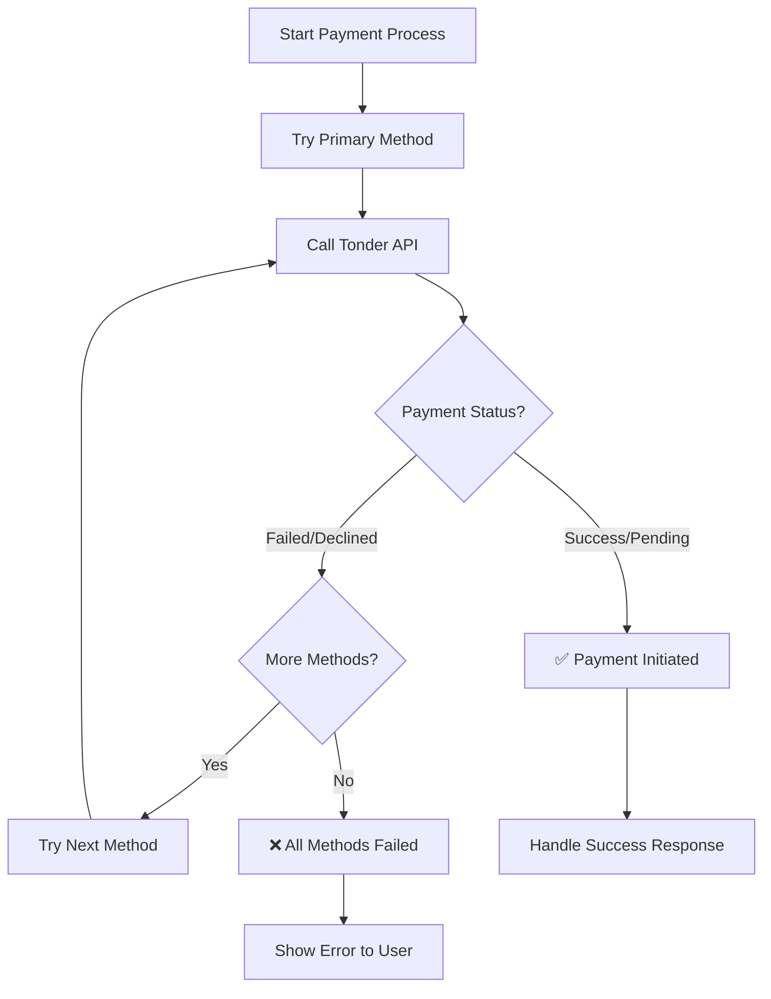

Multi-method payments allow you to offer customers alternative payment options when their preferred method fails. For example, if a customer's credit card is declined, you can automatically offer them a SPEI bank transfer or OXXO voucher as backup options.

This guide shows you how to implement a fallback payment system that tries multiple payment methods sequentially until one succeeds.

## Understanding Multi-Method Flow

The fallback logic works by creating a prioritized list of payment methods and attempting each one until a transaction succeeds. This approach ensures that if a customer's preferred payment method fails (due to insufficient funds, card declined, or technical issues), your system automatically tries alternative methods without requiring the customer to manually select a different option.

The fallback logic works by creating a prioritized list of payment methods and attempting each one until a transaction succeeds:



### Fallback Flow Summary

The multi-method payment flow follows these key steps:

1. Start with the customer's preferred payment method and call the Tonder API.
2. Check the payment response status - if successful or pending, complete the transaction.
3. If the payment fails or is declined, check if alternative payment methods are available.
4. If more methods exist, automatically try the next method in your priority list.
5. If all methods have been exhausted, show an error message to the customer.
6. Handle the final result - either process the successful payment or inform the customer of failure.

<Warning>
**User Experience First**

Always inform users about fallback attempts. Ask for permission before switching to alternative methods rather than automatically redirecting to methods they didn't choose.
</Warning>

## Step 1: Define Your Fallback Strategy

Plan your payment method priority order. A typical fallback sequence might be:

1. Card: The most common and immediate method.
2. SPEI: A reliable alternative, especially for larger amounts.
3. OXXO: A final fallback for users who may not have a bank account or card.

Your server-side logic controls this flow. The Tonder API processes each request as a standalone transaction.

<Info>
**Implementation Flexibility**

The fallback logic shown in this guide is just one example approach. You're free to implement your own custom strategy based on your business needs, such as:

- Different priority orders for different customer segments
- Conditional fallbacks based on transaction amount
- Geographic or regulatory considerations
- User preference-driven fallback selection
</Info>

## Step 2: Implement the Fallback Loop

Create a function that tries each payment method sequentially until one succeeds. This implementation:

1. Defines a prioritized list of payment methods (CARD, SPEI, OXXO pay).
2. Attempts each method in order until one succeeds.
3. Handles both API failures and payment declines gracefully.
4. Returns the successful transaction response or raises an exception if all methods fail.
5. Includes proper logging for debugging and monitoring.

```python
import uuid

# Assume 'tonder_api' is an initialized client for making API calls
# class TonderAPI:
#     def process_payment(self, payment_data):
#         # ... logic to make a POST request to /process/
#         # ... returns the JSON response as a dict

def process_payment_with_fallback(customer_data, amount, preferred_method="CARD"):
    """
    Attempts to process a payment using a preferred method, with fallbacks.
    
    Args:
        customer_data (dict): The customer's details (name, email).
        amount (float): The payment amount.
        preferred_method (str): The initial payment method to try.
    
    Returns:
        dict: The successful transaction response from the Tonder API.
    
    Raises:
        Exception: If all payment methods fail.
    """
    
    # Define the prioritized list of payment methods
    payment_methods_priority = [
        preferred_method,
        "CARD",  # Fallback to card if it wasn't the preferred method
        "SPEI",  # Next, try a bank transfer
        "oxxopay"   # Final fallback is a cash payment
    ]
    
    # Use a set to avoid duplicate attempts (e.g., if preferred_method is 'CARD')
    unique_methods = list(dict.fromkeys(payment_methods_priority))
    
    for method in unique_methods:
        print(f"Attempting payment with method: {method}")
        try:
            # Construct the payment request body
            payment_data = {
                "operation_type": "payment",
                "amount": amount,
                "currency": "MXN",
                "customer": customer_data,
                "payment_method": {"type": method},
                "client_reference": f"order-{uuid.uuid4()}"
            }
            
            # Make the API call
            result = tonder_api.process_payment(payment_data)
            
            # A successful initiation will have a status of 'authorized' or 'pending'.
            # A 'declined' status is a failure for this attempt.
            if result.get("status") in ["authorized", "pending"]:
                print(f"Payment successfully initiated with {method}. Transaction ID: {result['id']}")
                return result
            else:
                # Handle declines or other failures before trying the next method
                print(f"Payment with {method} failed with status: {result.get('status')}")
                # In a real application, you might log the specific error message
                
        except Exception as e:
            # This handles API call failures (e.g., network errors, 500s)
            print(f"API call for payment method {method} failed: {e}")
            continue
    
    # If the loop completes without returning, all methods have failed.
    raise Exception("All payment methods failed for this transaction.")
```

## Next Steps

- Review individual [payment method guides](/direct-integration/payment-methods/payment-methods-overview) to understand each method's specific requirements.
- Set up [webhooks](/direct-integration/webhooks/how-webhooks-works) to handle asynchronous payment status updates.
- Implement [error handling](/direct-integration/http-response-codes) to gracefully manage payment failures.
- Test different scenarios using [testing data](/direct-integration/testing-data) to validate your fallback logic.
