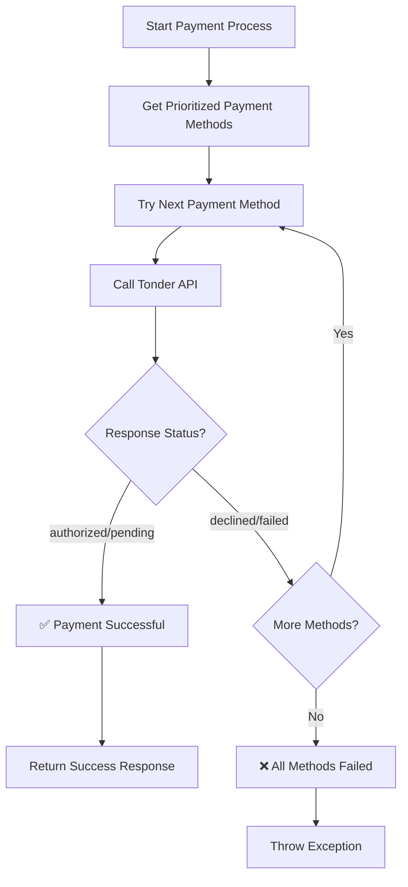

In some use cases, you may want to offer customers a fallback payment option if their preferred method fails. For example, if a customer's credit card is declined, you could automatically offer them the option to pay via a SPEI bank transfer.

This guide demonstrates a strategy for implementing a multi-method payment flow on your server.

## User Experience Considerations

While this logic can be powerful, it's important to consider the user experience:

  * Always inform users what's happening during the payment process. If their card is declined, explicitly ask them if they'd like to try another way, rather than automatically creating an OXXO voucher they didn't ask for.
  * User choice often works better than automatic fallbacks. Your server can provide a list of available methods, and the client-side application can present these options to the user if the initial payment fails.
  * Asynchronous payments require special handling since fallbacks like SPEI and OXXO have `pending` status. Your application flow must be able to guide the user on the next steps (e.g., displaying the payment voucher).

## The Concept: A Fallback Flow

The core idea is to create a prioritized list of payment methods and attempt to create a payment with each one sequentially until a transaction is successfully initiated.

A typical fallback order might be:

1.  **Card**: The most common and immediate method.
2.  **SPEI**: A reliable alternative, especially for larger amounts.
3.  **OXXO**: A final fallback for users who may not have a bank account or card.

Your server-side logic would control this flow. The Tonder API itself processes each request as a standalone transaction.

<Info>
**Implementation Flexibility**

The fallback logic shown in this guide is just one example approach. You're free to implement your own custom strategy based on your business needs, such as:

- Different priority orders for different customer segments
- Conditional fallbacks based on transaction amount
- Geographic or regulatory considerations
- User preference-driven fallback selection
</Info>

## Implementation Example

This section demonstrates how to implement a fallback payment mechanism. We'll start with a visual overview of the logic, then break down each step, and finally show the complete Python implementation.

### Fallback Flow Logic

The following Mermaid diagram illustrates the decision flow for the fallback payment logic:



### Step-by-Step Logic

Here's how the fallback logic works in detail:

1. Define payment methods in order of preference starting with the user's preferred method
2. Remove duplicate methods to ensure each is only tried once
3. Iterate through each payment method, making API calls sequentially
4. Check the response status to determine if the payment was successful or failed
5. Return the transaction details when a payment succeeds with `authorized` or `pending` status
6. Continue to the next method if the payment fails, or throw an exception if all methods are exhausted

### Python Implementation

The following Python code demonstrates how to implement the fallback logic described above:

```python
import uuid

# Assume 'tonder_api' is an initialized client for making API calls
# class TonderAPI:
#     def process_payment(self, payment_data):
#         # ... logic to make a POST request to /process/
#         # ... returns the JSON response as a dict

def process_payment_with_fallback(customer_data, amount, preferred_method="CARD"):
    """
    Attempts to process a payment using a preferred method, with fallbacks.
    
    Args:
        customer_data (dict): The customer's details (name, email).
        amount (float): The payment amount.
        preferred_method (str): The initial payment method to try.
    
    Returns:
        dict: The successful transaction response from the Tonder API.
    
    Raises:
        Exception: If all payment methods fail.
    """
    
    # Define the prioritized list of payment methods
    payment_methods_priority = [
        preferred_method,
        "CARD",  # Fallback to card if it wasn't the preferred method
        "SPEI",  # Next, try a bank transfer
        "OXXO"   # Final fallback is a cash payment
    ]
    
    # Use a set to avoid duplicate attempts (e.g., if preferred_method is 'CARD')
    unique_methods = list(dict.fromkeys(payment_methods_priority))
    
    for method in unique_methods:
        print(f"Attempting payment with method: {method}")
        try:
            # Construct the payment request body
            payment_data = {
                "operation_type": "payment",
                "amount": amount,
                "currency": "MXN",
                "customer": customer_data,
                "payment_method": {"type": method},
                "client_reference": f"order-{uuid.uuid4()}"
            }
            
            # Make the API call
            result = tonder_api.process_payment(payment_data)
            
            # A successful initiation will have a status of 'authorized' or 'pending'.
            # A 'declined' status is a failure for this attempt.
            if result.get("status") in ["authorized", "pending"]:
                print(f"Payment successfully initiated with {method}. Transaction ID: {result['id']}")
                return result
            else:
                # Handle declines or other failures before trying the next method
                print(f"Payment with {method} failed with status: {result.get('status')}")
                # In a real application, you might log the specific error message
                
        except Exception as e:
            # This handles API call failures (e.g., network errors, 500s)
            print(f"API call for payment method {method} failed: {e}")
            continue
    
    # If the loop completes without returning, all methods have failed.
    raise Exception("All payment methods failed for this transaction.")

# --- Example Usage ---
# customer = {"name": "Test Fallback", "email": "fallback@example.com"}
# try:
#     successful_transaction = process_payment_with_fallback(customer, 250.00, "CARD")
#     # Now handle the successful transaction (e.g., redirect for 3DS, show OXXO voucher)
# except Exception as e:
#     print(e)
```

## Next Steps

- Review individual [payment method guides](/direct-integration/payment-methods/payment-methods-overview) to understand each method's specific requirements
- Set up [webhooks](/direct-integration/webhooks/how-webhooks-works) to handle asynchronous payment status updates
- Implement [error handling](/direct-integration/http-response-codes) to gracefully manage payment failures
- Test different scenarios using [testing data](/direct-integration/testing-data) to validate your fallback logic
