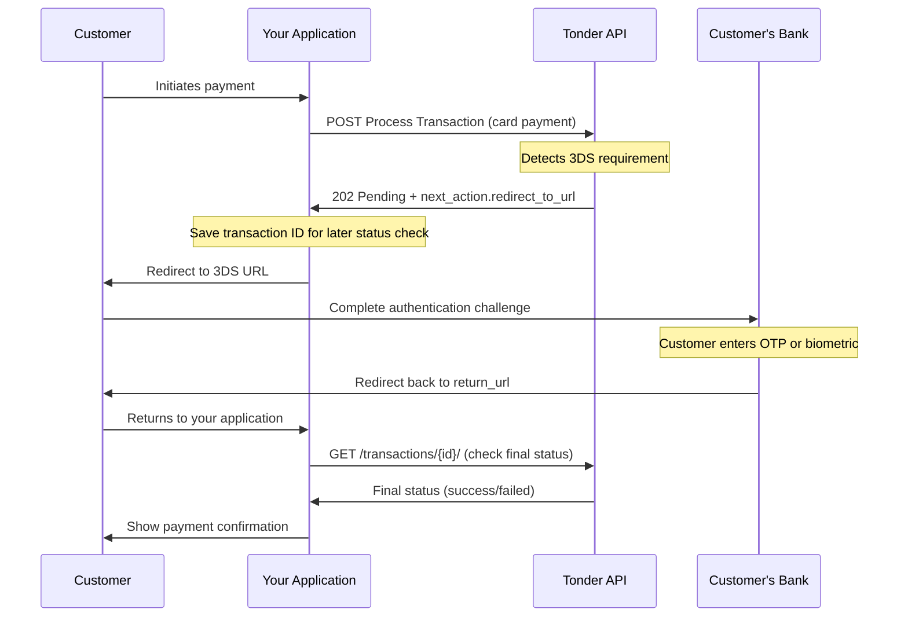

3D Secure (3DS) is an authentication protocol that adds an extra layer of security to online card payments. It helps prevent fraud by verifying the cardholder's identity, often through a code sent to their phone or a prompt in their banking app.

When a card-issuing bank requires this extra verification, the Tonder API will respond with a special `next_action` object, telling you how to proceed.

## The 3DS Payment Flow

Here is the visual representation of the flow for a payment that requires 3D Secure authentication:



The 3D Secure flow follows these key steps:

1. The customer initiates a payment and your app [sends a POST request to the Tonder API](#step-1-initiating-the-payment) with card payment details.
2. Tonder detects that 3DS authentication is required and [returns a 202 status with a redirect URL](#step-2-handling-the-next_action-response) in the next_action field.
3. Your app saves the transaction ID and redirects the customer to the 3DS authentication URL.
4. The customer completes the bank's authentication challenge (OTP, biometric, etc.) and the bank redirects them back to your return URL.
5. Your app [queries the transaction status](#step-3-checking-the-final-status) using the saved transaction ID and displays the final result to the customer.

This asynchronous flow requires you to handle redirects and check the final transaction status after the customer completes authentication.

## Step 1: Initiating the Payment

The initial request follows the same structure as a standard card payment, but it's crucial to include a `return_url` so the customer can be redirected back to your site after completing the 3DS challenge.

Send a `POST` request to the [Process Transaction](/reference/process-transaction) endpoint with the required parameters below:

### Required Parameters

| Parameter | Type | Description |
|-----------|------|-------------|
| operation_type | string | Must be `"payment"` to process a payment |
| amount | number | Payment amount (e.g., `150.00`) |
| currency | string | Currency code (e.g., `"MXN"` for Mexican Peso) |
| customer | object | Customer information containing `name` and `email` |
| payment_method | object | Payment method details including `type` and card information |
| client_reference | string | Your unique reference for this transaction |
| return_url | string | URL where customer returns after 3DS authentication |

This request initiates the payment and triggers the 3DS check if required by the customer's bank:

```json Initial Request
{
  "operation_type": "payment",
  "amount": 150.00,
  "currency": "MXN",
  "customer": {
    "name": "Test Customer",
    "email": "test@example.com"
  },
  "payment_method": {
    "type": "CARD",
    "card_number": "4000000000000119" // Test card that triggers 3DS
  },
  "client_reference": "order-3ds-test-001",
  "return_url": "https://your-store.com/payment/complete"
}
```

## Step 2: Handling the `next_action` Response

If 3DS authentication is required, the API will respond with a `status` of `pending` and a `next_action` object containing the redirect URL for the customer's authentication.

<Warning>
**Important: Save the transaction ID**

You must save the `id` from this response as you'll need it later to check the final payment status after the customer completes the 3DS challenge.
</Warning>

Here's an example of the response when 3DS is required:

```json Next Action Response
{
  "id": "550e8400-e29b-41d4-a716-446655440000",
  "operation_type": "payment",
  "status": "pending",
  "amount": 150.00,
  "currency": "MXN",
  "next_action": {
    "redirect_to_url": {
      "url": "https://secure.payment-provider.com/3ds/abc123",
      "return_url": "https://your-store.com/payment/complete",
      "verify_transaction_status_url": "/api/v1/stripe/business/123/payments/456/transactions/789"
    }
  },
  "created_at": "2024-07-26T10:30:00Z",
  "status_code": 202
}
```

When you receive a response with `next_action`, you need to:

1. Store the `responseData.id` for later status verification.
2. Check for the redirect URL in `next_action.redirect_to_url.url`.
3. Redirect the customer to complete the 3DS challenge.

The following JavaScript code demonstrates how to handle the API response, determine if 3DS authentication is required, save the transaction ID for later use, and redirect the customer to their bank's authentication page when necessary:

```javascript
// Example client-side JavaScript to handle the redirect
const responseData = { /* The JSON response from the API */ };

// CRITICAL: Save the transaction ID for later status check
const transactionId = responseData.id;
localStorage.setItem('pendingTransactionId', transactionId);

if (responseData.next_action && responseData.next_action.redirect_to_url) {
  // Redirect the user to their bank's 3DS authentication page
  window.location.href = responseData.next_action.redirect_to_url.url;
} else {
  // Handle final status (e.g., authorized, declined) for non-3DS payments
  console.log('Payment completed with status:', responseData.status);
}
```

## Step 3: Verifying the Final Status

Once the customer completes the 3DS challenge, their bank will redirect them back to the `return_url` you provided.

At this point, the transaction has been processed, but you still need to get its final status. Use the transaction `id` that you saved from the initial response to query the [Get Transaction Status](/reference/get-transaction-status) endpoint:

```bash
curl -X GET https://stage.tonder.io/api/v1/transactions/550e8400-e29b-41d4-a716-446655440000/ \
-H "Authorization: Token <YOUR_SANDBOX_API_KEY>"
```

The response will show the final status of the transaction after 3DS completion:

```json Final Status Response
{
  "id": "550e8400-e29b-41d4-a716-446655440000",
  "operation_type": "payment",
  "status": "success",
  "amount": 150.00,
  "currency": "MXN",
  "merchant_reference": "order-3ds-test-001",
  "created_at": "2024-07-26T10:30:00Z",
  "updated_at": "2024-07-26T10:32:15Z",
  "completion_details": {
    "completed_at": "2024-07-26T10:32:15Z",
    "authorization_code": "AUTH123456"
  }
}
```

You can now confidently update the order status in your system and show the customer a confirmation page.

<Tip>
While polling the status endpoint after the redirect works, the best practice is to use **[Webhooks](/direct-integration/webhooks/how-webhooks-works)**. A webhook will proactively notify your server as soon as the final status is available, providing a more efficient and reliable update mechanism.
</Tip>

## Next Steps

- Learn how to [create payments with card tokens](/direct-integration/guides/create-payments/create-a-payment-with-a-card-token) to securely store and reuse customer payment methods.
- Set up [webhooks](/direct-integration/webhooks/how-webhooks-works) to receive real-time notifications when payment statuses change.
- Explore [HTTP response codes](/direct-integration/http-response-codes) to understand how to handle different API responses and error scenarios.
