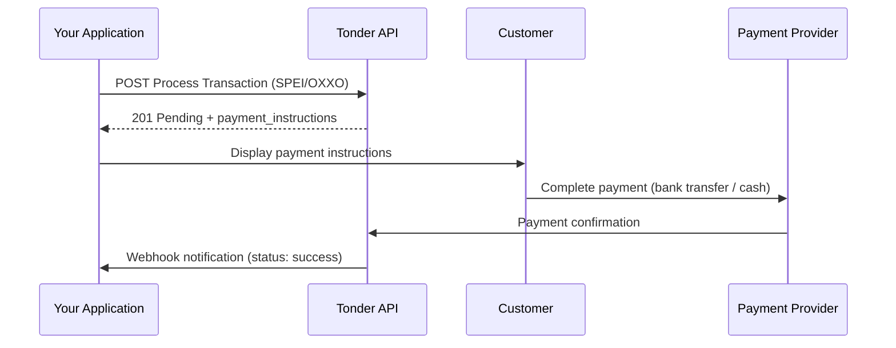

This guide shows you how to create payments using alternative payment methods (APMs) through Tonder's unified [Process Transaction](/reference/process-transaction) endpoint. You can process local payment options like SPEI bank transfers and OXXO Pay cash payments through a single, consistent API call.

<Info>
**Looking for card payments?**

This guide covers non-card payment methods only. For credit and debit card processing, see the [Card Payments Overview](/direct-integration/guides/create-payments/card-payments-overview).
</Info>

## Step 1: The Core Request

All payments are created by sending a `POST` request to the [Process Transaction](/reference/process-transaction) endpoint. The request body must contain required fields that are common to all payment methods, plus a `payment_method` object with specific fields for your chosen payment method.

<Tabs>
  <Tab title="Sandbox">
    ```
    POST https://stage.tonder.io/api/v1/process/
    ```
  </Tab>
  <Tab title="Production">
    ```
    POST https://app.tonder.io/api/v1/process/
    ```
  </Tab>
</Tabs>

### Basic Request Structure

Every payment request to the [Process Transaction](/reference/process-transaction) endpoint follows this structure:

```json
{
  "operation_type": "payment",
  "amount": 100.00,
  "currency": "MXN",
  "customer": {
    "name": "Test Customer",
    "email": "test@example.com"
  },
  "payment_method": {
    "type": "SPEI"
    // ... additional fields based on the type
  },
  "client_reference": "your-internal-order-id-123"
}
```

These fields are required for all payment requests:

| Field               | Type      | Description                                                                                 |
|---------------------|-----------|---------------------------------------------------------------------------------------------|
| `operation_type`    | string    | Must be `"payment"` to process a payment transaction.                              |
| `amount`            | decimal   | Transaction amount using a dot as decimal separator (e.g., `100.00`).             |
| `currency`          | string    | Transaction currency. Currently only `"MXN"` (Mexican Peso) is supported.                                             |
| `customer`          | object    | Customer information containing at minimum `name` (string) and `email` (string).                      |
| `payment_method`    | object    | Payment method configuration with a `type` field and method-specific parameters.   |
| `client_reference`  | string    | Your unique transaction identifier for reconciliation and tracking purposes.         |

<Note>
Depending on the payment method you choose, additional fields may be required inside the `payment_method` object. For detailed information about each payment method and their specific requirements, see the [Payment Methods Overview](/direct-integration/payment-methods/payment-methods-overview).
</Note>

## Step 2: Processing Different Payment Methods

To process a specific payment method, you change the `type` inside the `payment_method` object and provide any required additional fields. The examples below show how to process different payment methods.

<AccordionGroup>
<Accordion title="SPEI Bank Transfer">
To let a customer pay via a SPEI transfer, set the `type` to `SPEI`. The API will generate payment instructions for the customer. Here's an example request:

```json SPEI Bank Transfer
{
  "operation_type": "payment",
  "amount": 500.00,
  "currency": "MXN",
  "customer": {
    "name": "Carlos Eduardo López",
    "email": "carlos.lopez@empresa.mx"
  },
  "payment_method": {
    "type": "SPEI"
  },
  "client_reference": "spei-test-001"
}
```

A successful SPEI response will have a status of `pending` and includes payment instructions for the customer:

```json SPEI Payment Response
{
  "id": "550e8400-e29b-41d4-a716-446655440001",
  "operation_type": "payment",
  "status": "pending",
  "amount": 500.00,
  "currency": "MXN",
  "merchant_reference": "spei-test-001",
  "payment_id": 12346,
  "transaction_id": "txn_spei456",
  "provider": "spei_provider",
  "created_at": "2024-07-26T10:35:00Z",
  "status_code": 201,
  "payment_instructions": {
    "clabe": "646180157000000004",
    "reference": "7812345678",
    "expires_at": "2024-07-27T10:35:00Z",
    "bank_name": "STP"
  }
}
```

<Tip>
Display the `payment_instructions` to your customer so they can complete the bank transfer. The `clabe` is the destination account number and `reference` should be included in the transfer description.
</Tip>
</Accordion>

<Accordion title="OXXO Pay Cash Payment">
To generate a voucher for a cash payment at an OXXO store, set the `type` to `oxxopay`. Here's an example request:

```json OXXO Cash Payment
{
  "operation_type": "payment",
  "amount": 250.00,
  "currency": "MXN",
  "customer": {
    "name": "María Isabel Fernández",
    "email": "maria.fernandez@email.com"
  },
  "payment_method": {
    "type": "oxxopay"
  },
  "client_reference": "oxxopay-test-001"
}
```

A successful OXXO Pay response will have a status of `pending` and includes a url to payment instructions and reference for the customer:

```json OXXO Payment Response
{
  "id": "887e3ff0-4f28-456d-bf33-857de2cdf788",
  "operation_type": "payment",
  "status": "Pending",
  "amount": 34.0,
  "currency": "MXN",
  "client_reference": "oxxo deposit test",
  "metadata": {
    "id_casino": "id Lidem"
  },
  "provider": "tonder",
  "created_at": "2026-02-17T21:32:28.887557Z",
  "status_code": 201,
  "next_action": {
    "redirect_to_url": {
      "url": "https://stage-payflow.tonder.io/oxxo-pay?token=eyJhbGciOiJIUzI1NiIsInR5cCI6IkpXVCJ9..."
    }
  },
  "verify_transaction_status_url": "/transactions/887e3ff0-4f28-456d-bf33-857de2cdf788/"
}
```

<Tip>
Display the voucher image and reference number to your customer. They can present either at any OXXO store to complete the payment. Note that OXXO payments typically have a longer expiration window (usually 7 days).
</Tip>
</Accordion>
</AccordionGroup>

For detailed information about each payment method and their specific requirements, see the [Payment Methods Overview](/direct-integration/payment-methods/payment-methods-overview).

## Step 3: Handling the Response

After you send the request, the API will respond immediately with the initial status of the transaction.

The `status` field can have one of the following values:

| Status | Description |
|--------|-------------|
| `pending` | Transaction is being processed (common for asynchronous payments) |
| `on_hold` | Transaction is temporarily held for review |
| `processing` | Transaction is being processed by the payment provider |
| `sent_to_provider` | Transaction has been sent to the payment provider |
| `success` | Transaction completed successfully |
| `paid_full` | Payment has been fully processed and settled |
| `in_transit` | Funds are in transit to your account |
| `canceled` | Transaction was canceled before completion |
| `declined` | Payment was declined by the provider |
| `rejected` | Transaction was rejected |
| `failed` | Transaction failed to process |
| `expired` | Transaction expired before completion |
| `Unknown` | Status is unknown or unclear |

<Warning>
**Validation of `id` and `status` fields**

For proper payment validation, you must check:
- `id` is the unique transaction identifier - store this for future reference.
- `status` is the current payment state - determines next actions.

Never rely on HTTP status codes alone for payment validation.
</Warning>

The table below details the fields that are returned in the response:

| Field | Type | Description |
|-------|------|-------------|
| `id` | string | Unique transaction identifier |
| `operation_type` | string | Always `"payment"` |
| `status` | string | Transaction status |
| `amount` | decimal | Transaction amount |
| `currency` | string | Currency code |
| `client_reference` | string | Your reference identifier |
| `payment_id` | integer | Internal payment ID |
| `transaction_id` | string | Provider transaction ID |
| `provider` | string | Payment provider used |
| `created_at` | string | ISO 8601 timestamp |
| `status_code` | integer | HTTP status code |
| `payment_instructions` | object | Instructions for completing payment (APMs only) |

### Asynchronous Payment Flow

SPEI and OXXO payments are **asynchronous**. The initial status will always be `pending` because they require the customer to take further action (complete a bank transfer or visit an OXXO store).

You must use [Webhooks](/direct-integration/webhooks/how-webhooks-works) or poll the transaction status endpoint to know when the payment is completed.



## Step 4: Check the Transaction Status

For asynchronous payments, or if you need to confirm the final status of any transaction, you can query the transaction status using the [Get Transaction Status](/reference/get-transaction-status) endpoint with the `id` from the payment response:

```bash cURL
curl -X GET https://stage.tonder.io/api/v1/transactions/550e8400-e29b-41d4-a716-446655440000/ \
-H "Authorization: Token <YOUR_SANDBOX_API_KEY>"
```

This will return the full transaction object with its current status (e.g., `success`, `failed`, `expired`). Always validate both the `id` and `status` fields in the response.

## Next Steps

- Explore [Card Payments](/direct-integration/guides/create-payments/card-payments-overview) to process credit and debit card transactions.
- Set up [webhooks](/direct-integration/webhooks/how-webhooks-works) to receive real-time notifications when payment statuses change.
- Review the [Payment Methods Reference](/direct-integration/payment-methods/payment-methods-reference) for complete API specifications.
- Implement [Multi-Method Payments](/direct-integration/guides/create-payments/create-a-multi-method-payment) for fallback payment flows.
