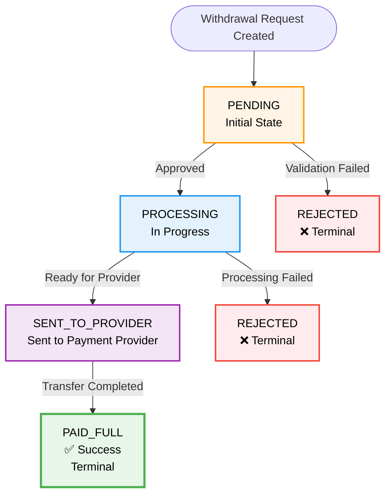

This guide explains the complete withdrawal workflow, status codes, and how withdrawals progress through the system.

## Core Process Flow

The withdrawal process follows these stages:

1. **Request Withdrawal** (User/System) - Initial withdrawal request is created
2. **Perform Validations and gather bank data** (Merchant) - Merchant validates the request
3. **Send Withdrawal Request** (Merchant → Tonder) - Request is submitted to Tonder API
4. **Respond with Pending ID** (Tonder → Merchant) - Tonder returns withdrawal ID with `PENDING` status
5. **Approve Withdrawal** (via API or Platform) - Withdrawal is approved for processing
6. **Send Withdrawal Request to Acquirer** (Tonder → Acquirer) - Request is forwarded to payment provider
7. **Status Updates** - Status updates occur over time via webhooks

## Status Codes & Flows

The following table describes each status and the possible transitions:

| Status Code | Description | Successful Flow Path | Failure Flow Path |
|-------------|-------------|---------------------|-------------------|
| `PENDING` | Initial state after request creation | → `PROCESSING` | → `REJECTED` |
| `PROCESSING` | Approved and in progress | → `SENT_TO_PROVIDER` | → `REJECTED` |
| `SENT_TO_PROVIDER` | Request sent to the external payment provider | → `PAID_FULL` | - |
| `PAID_FULL` | Withdrawal fully paid successfully | End State | - |
| `REJECTED` | Withdrawal rejected (by system or action) | - | End State |

### Status Flow Diagram

## Status Descriptions

### PENDING

The withdrawal request has been created and is awaiting approval or initial processing.

**What happens next:**
- The withdrawal may be automatically approved if validation passes
- It may require manual approval depending on your configuration
- It will transition to `PROCESSING` when approved, or `REJECTED` if validation fails

### PROCESSING

The withdrawal has been approved and is currently being processed by Tonder's systems.

**What happens next:**
- The withdrawal is being validated and prepared for the payment provider
- It will transition to `SENT_TO_PROVIDER` when ready, or `REJECTED` if processing fails

### SENT_TO_PROVIDER

The withdrawal request has been successfully sent to the external payment provider (bank, card network, etc.).

**What happens next:**
- The payment provider processes the transfer
- It will transition to `PAID_FULL` when the transfer completes successfully
- This is typically the final processing stage before completion

### PAID_FULL

The withdrawal has been fully paid and the funds have been successfully transferred to the beneficiary.

**What happens next:**
- This is a terminal success state
- No further status changes will occur
- The withdrawal is complete

### REJECTED

The withdrawal has been rejected and will not be processed.

**Rejection reasons may include:**
- Invalid beneficiary account information
- Insufficient funds
- Compliance or fraud checks failed
- Manual rejection by merchant or system

**What happens next:**
- This is a terminal failure state
- No further status changes will occur
- You may need to create a new withdrawal request with corrected information

## Monitoring Status Changes

### Webhooks (Recommended)

Configure webhooks to receive real-time notifications when withdrawal statuses change. Each webhook includes:

- The complete withdrawal object with current status
- A `status_changes` array showing the transition history
- Timestamps for each status change

See [Webhook Payloads](/withdrawals-api/webhooks/webhook-payloads) for details on webhook structure.

### Status Polling

You can also poll the withdrawal status using the withdrawal ID returned in the creation response. However, webhooks are recommended for real-time updates.

## HTTP Response Codes

The API uses standard HTTP status codes to indicate request outcomes:

| Code | Meaning | Description |
|------|---------|-------------|
| `200` | Success | Request completed successfully |
| `400` | Bad Request | Invalid request parameters or data |
| `401` | Unauthorized | Missing or invalid authentication token |
| `404` | Not Found | Withdrawal ID not found |
| `500` | Internal Server Error | Server-side error occurred |

See [HTTP Response Codes Reference](/withdrawals-api/reference/http-response-codes) for detailed error handling.

## Best Practices

1. **Always handle webhooks**: Set up webhook listeners to receive status updates automatically
2. **Save withdrawal IDs**: Store the withdrawal ID from the creation response for tracking
3. **Handle rejections**: Implement logic to handle `REJECTED` status and notify users
4. **Monitor timeouts**: Some statuses may take time; implement appropriate timeout handling
5. **Log status changes**: Keep an audit trail of all status transitions for debugging

## Next Steps

- Learn about [system architecture](/withdrawals-api/webhooks/architecture) to understand the processing system
- Set up [webhook listeners](/withdrawals-api/webhooks/webhook-payloads) to receive status updates
- Review [testing requirements](/withdrawals-api/reference/testing) to validate your status handling

