This reference provides detailed information about all withdrawal status codes, their meanings, and valid transitions.

## Status Code Overview

Withdrawal statuses represent the current state of a withdrawal request as it progresses through the system. Each status indicates a specific stage in the processing lifecycle.

## Status Codes

### PENDING

**Description**: Initial state after request creation.

**Meaning**: The withdrawal request has been received and is queued for processing. It may require approval before proceeding.

**Possible Transitions**:
- → `PROCESSING` (when approved and processing begins)
- → `REJECTED` (if validation fails or manually rejected)

**Typical Duration**: Seconds to minutes, depending on approval requirements.

### PROCESSING

**Description**: Approved and in progress.

**Meaning**: The withdrawal has been approved and is currently being processed by Tonder's systems. Validation and preparation are underway.

**Possible Transitions**:
- → `SENT_TO_PROVIDER` (when ready to send to payment provider)
- → `REJECTED` (if processing fails)

**Typical Duration**: Minutes to hours, depending on transfer method and provider.

### SENT_TO_PROVIDER

**Description**: Request sent to the external payment provider.

**Meaning**: The withdrawal request has been successfully sent to the payment provider (bank, card network, etc.). The provider is now processing the transfer.

**Possible Transitions**:
- → `PAID_FULL` (when transfer completes successfully)

**Typical Duration**: 
- SPEI: Same business day during banking hours
- Debit Card: 5-15 minutes

### PAID_FULL

**Description**: Withdrawal fully paid successfully.

**Meaning**: The withdrawal has been completed and funds have been successfully transferred to the beneficiary account. This is a terminal success state.

**Possible Transitions**: None (terminal state)

**Typical Duration**: N/A (final state)

### REJECTED

**Description**: Withdrawal rejected (by system or action).

**Meaning**: The withdrawal has been rejected and will not be processed. This can occur at any stage due to validation failures, compliance issues, or manual rejection.

**Possible Transitions**: None (terminal state)

**Rejection Reasons**:
- Invalid beneficiary account information
- Insufficient funds
- Compliance or fraud check failures
- Invalid or missing required data
- Manual rejection by merchant or system

**Typical Duration**: N/A (final state)

## Status Flow Diagram

```mermaid
flowchart TD
    PENDING[PENDING<br/>⏳ Initial State] -->|Approved| PROCESSING[PROCESSING<br/>⚙️ In Progress]
    PENDING -->|Validation Failed| REJECTED1[REJECTED<br/>❌ Terminal State]
    
    PROCESSING -->|Ready for Provider| SENT[SENT_TO_PROVIDER<br/>📤 Sent to Payment Provider]
    PROCESSING -->|Processing Failed| REJECTED2[REJECTED<br/>❌ Terminal State]
    
    SENT -->|Transfer Completed| PAID[PAID_FULL<br/>✅ Success<br/>Terminal State]
    
    style PENDING fill:#fff4e6,stroke:#ff9800,stroke-width:2px,color:#000
    style PROCESSING fill:#e3f2fd,stroke:#2196f3,stroke-width:2px,color:#000
    style SENT fill:#f3e5f5,stroke:#9c27b0,stroke-width:2px,color:#000
    style PAID fill:#e8f5e9,stroke:#4caf50,stroke-width:3px,color:#000
    style REJECTED1 fill:#ffebee,stroke:#f44336,stroke-width:2px,color:#000
    style REJECTED2 fill:#ffebee,stroke:#f44336,stroke-width:2px,color:#000
```

<Info>
**Status Flow Overview**

- **Success Path**: PENDING → PROCESSING → SENT_TO_PROVIDER → PAID_FULL
- **Failure Path**: PENDING or PROCESSING → REJECTED
- **Terminal States**: PAID_FULL (success) and REJECTED (failure) cannot transition to other states
</Info>

## Status Transition Rules

### Valid Transitions

| From Status | To Status | Condition |
|-------------|-----------|-----------|
| `PENDING` | `PROCESSING` | Withdrawal approved |
| `PENDING` | `REJECTED` | Validation failed or rejected |
| `PROCESSING` | `SENT_TO_PROVIDER` | Ready for provider |
| `PROCESSING` | `REJECTED` | Processing failed |
| `SENT_TO_PROVIDER` | `PAID_FULL` | Transfer completed |

### Invalid Transitions

The following transitions are not possible:
- `PAID_FULL` → Any other status
- `REJECTED` → Any other status
- `SENT_TO_PROVIDER` → `PROCESSING` or `PENDING`
- `PROCESSING` → `PENDING`

## Status Monitoring

### Webhooks

Status changes are automatically sent via webhooks. Each webhook includes:
- Current status
- Previous status (in `status_changes` array)
- Timestamp of the change
- Reason for the change (if applicable)

### Status Polling

You can also check status by querying the withdrawal using its ID. However, webhooks are recommended for real-time updates.

## Handling Different Statuses

### Success Path

Monitor for the progression: `PENDING` → `PROCESSING` → `SENT_TO_PROVIDER` → `PAID_FULL`

When `PAID_FULL` is received:
- Mark withdrawal as complete in your system
- Notify the user/beneficiary
- Update accounting records
- Archive the transaction

### Failure Path

Monitor for transitions to `REJECTED` from any status.

When `REJECTED` is received:
- Check the rejection reason in the webhook
- Notify the user/beneficiary
- Log the rejection for analysis
- Determine if a new withdrawal request is needed

## Status Timestamps

Each status change includes an ISO 8601 timestamp. Use these to:
- Calculate processing times
- Identify delays or issues
- Generate reports
- Debug problems

## Best Practices

1. **Handle all statuses**: Implement handlers for every possible status
2. **Monitor transitions**: Track status changes, not just current status
3. **Log status history**: Keep a complete audit trail
4. **Set timeouts**: Implement appropriate timeouts for each status
5. **Handle rejections**: Always handle `REJECTED` status gracefully

## Next Steps

- Review [withdrawal workflows](/withdrawals-api/guides/workflow-statuses) for process details
- Learn about [webhook payloads](/withdrawals-api/webhooks/webhook-payloads) to receive status updates
- Check [HTTP response codes](/withdrawals-api/reference/http-response-codes) for API error handling

